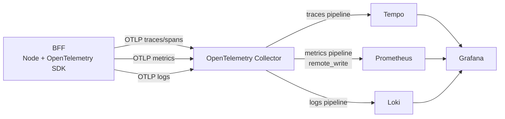

# Wallet Case

Repositório monorepo do projeto **Wallet Case**, contendo os aplicativos de **backend (BFF)** e **mobile** no mesmo workspace.

## Estrutura do monorepo

```text
wallet-case/
├── apps/
│   ├── bff/       # API/BFF com NestJS
│   └── mobile/    # App mobile com Expo + React Native
├── packages/      # Pacotes compartilhados (reservado para uso futuro)
├── biome.json
├── commitlint.config.cjs
└── package.json   # scripts e configuração dos workspaces
```

### Apps

- `apps/bff`: serviço backend em NestJS
- `apps/mobile`: aplicativo mobile em Expo/React Native

## Pré-requisitos

- Node.js (recomendado: versão LTS)
- npm

## Instalação

Na raiz do repositório:

```bash
npm install
```

## Execução do projeto

### Rodar BFF e Mobile juntos

```bash
npm run dev
```

Esse comando usa `concurrently` e executa em paralelo:

- `npm run dev:bff`
- `npm run dev:mobile`

### Rodar apenas o BFF

```bash
npm run dev:bff
```

### Rodar apenas o Mobile

```bash
npm run dev:mobile
```

### Rodar Mobile por plataforma

Android:

```bash
npm run dev:mobile:android
```

iOS:

```bash
npm run dev:mobile:ios
```

## Testes

Executar apenas os testes do BFF:

```bash
npm run test:bff
```

Executar apenas os testes do Mobile:

```bash
npm run test:mobile
```

## Qualidade de código

### BiomeJS

O projeto utiliza **BiomeJS** para lint e formatação centralizados via `biome.json`.

Principais pontos já configurados:

- Formatação padronizada (indentação, largura de linha, aspas, etc.)
- Regras de lint recomendadas e específicas do projeto
- `organizeImports` habilitado
- Exclusão de diretórios gerados (`node_modules`, `dist`, `build`, `coverage`, etc.)

Comandos:

```bash
npm run lint
npm run format
```

### Commitlint + Husky

O repositório usa **Commitlint** com `@commitlint/config-conventional` para validar mensagens de commit.

- Configuração: `commitlint.config.cjs`
- Hook: `.husky/commit-msg`

Exemplo de mensagem válida:

```text
feat(mobile): adiciona fluxo inicial de autenticação
```

## Decisões técnicas

### 1) Adoção de monorepo

Foi decidido usar **monorepo** para manter BFF e Mobile no mesmo repositório, facilitando:

- Visão unificada do projeto
- Desenvolvimento simultâneo do frontend mobile e backend
- Execução e avaliação técnica do projeto em um único setup

> Essa decisão também foi tomada para **facilitar a execução pelos avaliadores** em um único repositório.

### 2) Uso de npm

Foi decidido usar **npm** como gerenciador padrão de pacotes e workspaces.

Motivação:

- Maior compatibilidade com ambientes de desenvolvimento padrão
- Menor fricção para instalação e execução inicial

> Essa escolha foi feita para **maximizar a compatibilidade com o ambiente de desenvolvimento**.

### 3) Acoplamento intencional ao NestJS (contexto de avaliação)

Por se tratar de um **sistema de teste para fins de avaliação técnica**, algumas implementações foram mantidas de forma mais direta e pragmática dentro do ecossistema NestJS.

Exemplo prático:

- Parte da infraestrutura foi registrada diretamente como módulos/providers do Nest, sem camadas extras de abstração que aumentariam complexidade para este contexto.

Motivação:

- Reduzir tempo de implementação
- Facilitar entendimento e execução do projeto pelo avaliador
- Evitar overengineering para um cenário controlado de avaliação

### 4) Fluxo assíncrono com fila persistente em Redis

Para implementar o processamento assíncrono de pagamento com continuidade após restart do serviço, o workflow foi migrado para **BullMQ + Redis**.

Motivação:

- Persistir jobs do workflow fora da memória do processo
- Permitir reinício do BFF sem perder progresso dos eventos pendentes
- Manter encadeamento assíncrono dos steps com menor risco de perda em falhas locais

Com isso, o sistema processa o pagamento em etapas assíncronas com fila persistente, retomando o fluxo quando o serviço volta.

### 5) Atualização em tempo real via WebSocket no app mobile

Foi adotado **WebSocket (Gateway do Nest + Socket.IO no mobile)** para que o app receba atualizações de status do pagamento em tempo real na tela de feedback.

Benefícios da abordagem:

- Atualização contínua do status sem polling agressivo
- Integração simples com o fluxo assíncrono do backend
- Dispensa de sistema de push notifications para este caso de uso específico

Essa combinação permitiu uma experiência de acompanhamento em tempo real mantendo arquitetura e setup locais simples para avaliação.

## Infra local

O projeto possui observabilidade implementada no BFF e stack local provisionada com:

- **OpenTelemetry Collector** (ponto central de ingestão)
- **Tempo** (traces)
- **Prometheus** (métricas)
- **Loki** (logs)
- **Grafana** (visualização e correlação)
- **Redis** (fila persistente do workflow de pagamento)

### Ambiente e arquitetura

Todos os serviços sobem via `infra/docker-compose.yml` em uma rede bridge `observability`.

Serviços e portas:

- Grafana: `localhost:3001`
- Prometheus: `localhost:9090`
- Loki: `localhost:3100`
- Tempo: `localhost:3200`
- Redis: `localhost:6379`
- OTel Collector:
   - OTLP gRPC: `localhost:4317`
   - OTLP HTTP: `localhost:4318`
   - Métricas internas: `localhost:8888`
   - Health check: `localhost:13133`

### Fluxo de dados (trace, span, metric, log)

```text
BFF (Node + OTel SDK)
   ├─ traces/spans  ──OTLP──> OTel Collector ──> Tempo ──> Grafana
   ├─ metrics       ──OTLP──> OTel Collector ──> Prometheus (remote_write) ──> Grafana
   └─ logs          ──OTLP──> OTel Collector ──> Loki ──> Grafana
```



Detalhes importantes:

- O Collector recebe OTLP por HTTP (`4318`) e gRPC (`4317`).
- O pipeline de **traces** exporta para `tempo:4317`.
- O pipeline de **metrics** exporta para `prometheus:9090/api/v1/write` (remote write).
- O pipeline de **logs** exporta para `loki:3100/loki/api/v1/push`.
- O Prometheus está configurado para scrape das próprias métricas (`localhost:9090`) e das métricas internas do Collector (`otel-collector:8888`).

### Como subir e validar

```bash
cd infra/
docker compose up -d
docker compose ps
```

Para derrubar:

```bash
docker compose down
```

Para derrubar removendo volumes:

```bash
docker compose down -v
```

### Como a observabilidade está implementada no BFF

No BFF, a integração segue um padrão de **abstração + implementação OpenTelemetry**, acoplado ao Nest via **módulo global**.

#### 1) Bootstrap de telemetria

- `apps/bff/src/infrastructure/observability/telemetry-bootstrap.ts`
   - Inicializa `NodeSDK` com auto-instrumentação.
   - Configura exporters OTLP de trace, metric e logs.
   - Define `resource` (`service.name`, `service.namespace`, `deployment.environment`).
- `apps/bff/src/main.ts`
   - Executa `startTelemetry()` antes de subir o Nest.
   - Executa `shutdownTelemetry()` no encerramento (`SIGINT`/`SIGTERM`).

#### 2) Abstrações de domínio para observabilidade

Contratos:

- `AppLogger` (info/warn/error)
- `TraceInstrumenter` (`usingSpan`)
- `MetricRecorder` (`incrementCounter`/`recordHistogram`)

Implementações OTel:

- `OtelAppLogger`
- `OtelTraceInstrumenter`
- `OtelMetricRecorder`

#### 3) Integração global no Nest

`ObservabilityModule.forRoot()` registra e exporta os três contratos como providers globais:

- `AppLogger -> OtelAppLogger`
- `TraceInstrumenter -> OtelTraceInstrumenter`
- `MetricRecorder -> OtelMetricRecorder`

Esse módulo é importado em `AppModule`, permitindo injeção em qualquer feature/provider sem wiring repetitivo.

### Exemplos de implementação no código

#### Exemplo de tracing com `usingSpan`

No fluxo de pagamento (`PaymentService`):

```ts
return await this.traceInstrumenter.usingSpan("payment_execution", {}, async () => {
   // execução do fluxo
});
```

#### Exemplo de métricas (counter + histogram)

No mesmo serviço:

```ts
this.metricRecorder.recordHistogram("payment_creation_duration_ms", durationMs, {
   action: "payment_creation",
   outcome,
});

this.metricRecorder.recordHistogram("payment_execution_duration_ms", durationMs, {
   action: "payment_execution",
   outcome,
});

this.metricRecorder.incrementCounter("payment_total", 1, { outcome });
```

E por step:

```ts
this.metricRecorder.recordHistogram("payment_step_duration_ms", durationMs, { step, outcome });
this.metricRecorder.incrementCounter("payment_step_total", 1, { step, outcome });
```

#### Exemplo de logs correlacionados com trace/span

Nos adapters mock (ex.: `MockPaymentProcessor`):

```ts
this.appLogger.error("Payment processing failed", { context: "MockPaymentProcessor" });
this.appLogger.info("Payment processed successfully", { context: "MockPaymentProcessor" });
```

A implementação `OtelAppLogger` adiciona `trace_id` e `span_id` do contexto ativo quando houver span válido, permitindo navegação log → trace no Grafana.
Além disso, os logs carregam `event_name` padronizado para facilitar filtros no Loki/Grafana (ex.: `event_name="payment_processing_failed"`).

### Variáveis de ambiente úteis no BFF

Defaults já aplicados no bootstrap:

- `OTEL_SERVICE_NAME=bff`
- `OTEL_SERVICE_NAMESPACE=wallet-case`
- `NODE_ENV=dev`
- `OTEL_EXPORTER_OTLP_TRACES_ENDPOINT=http://localhost:4318/v1/traces`
- `OTEL_EXPORTER_OTLP_METRICS_ENDPOINT=http://localhost:4318/v1/metrics`
- `OTEL_EXPORTER_OTLP_LOGS_ENDPOINT=http://localhost:4318/v1/logs`
- `OTEL_METRIC_EXPORT_INTERVAL_MS=1000`

Para a fila de workflow no BFF:

- `REDIS_HOST=localhost`
- `REDIS_PORT=6379`
- `REDIS_DB=0`
- `REDIS_PASSWORD=` (opcional)

Para persistência de pagamentos no BFF (SQLite):

- `SQLITE_DB_PATH=data/wallet-case.sqlite`

### Acesso ao Grafana

- URL: <http://localhost:3001>
- Usuário: `admin`
- Senha: `admin`

Datasources são provisionados automaticamente em:

- `infra/grafana/provisioning/datasources/datasources.yml`

### Dashboard provisionada

Dashboard definida em:

- `infra/grafana/provisioning/dashboards/payment-observability.json`

Provisionamento da pasta no Grafana:

- provider `Wallet Case Dashboards`
- folder `Wallet Case`
- uid da dashboard: `bff-payments-overview`
- título: `BFF Payments Overview`
- refresh: `10s`
- janela padrão: últimos `15m`

Painéis já configurados:

- `Tentativas de Pagamento (Acumulado)` (stat)
- `Pagamentos Aprovados` (stat)
- `Tempo Médio do Pagamento` (stat)
- `Percentual de Sucesso (Pagamento)` (stat)
- `Tempo Médio por Step` (timeseries)
- `Eficiência por Step (Sem Retry Configurado)` (barchart)
- `Antifraud: Sucesso Sem vs Com Retry` (barchart)
- `Acquirer: Sucesso Sem vs Com Retry` (barchart)
- `Payment: Sucesso Sem vs Com Retry` (barchart)
- `Notification: Sucesso Sem vs Com Retry` (barchart)
- `Falhas na 1ª Tentativa por Step (Retry)` (barchart)
- `Traces Recentes (BFF)` (table via Loki + trace id)
- `Logs Recentes (BFF)` (table via Loki)
- `Distribuição de Erros por Step` (pie chart)

---

## Uso de IA no desenvolvimento

Durante o desenvolvimento deste projeto, estou utilizando IA como apoio, com os seguintes usos:

- **GitHub Copilot Pro** com seleção automática de modelo
- **Autocomplete** durante a implementação de funcionalidades
- **Geração de trechos simples e rotineiros**, como criar listas e renderizar com `map`
- **Iteração na IDE para lembrar e guiar integrações de observabilidade**, especialmente em pontos de configuração que eu não lembrava de cor, apesar de conhecer o caminho
- **Estruturação do ambiente de observabilidade com Docker Compose**, usando IA como apoio para organizar os serviços e suas integrações
- **Geração da dashboard de observabilidade de ponta a ponta**, guiando a IA com o que eu precisava visualizar e com as métricas disponíveis no projeto
- **Apoio na atualização da documentação** do projeto
