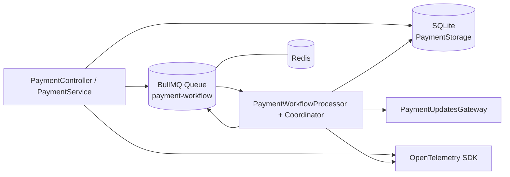

# Arquitetura do BFF

## Visão geral

O BFF foi construído em NestJS com foco em fluxo de pagamento assíncrono, persistência de estado e integração por contratos entre camadas. A aplicação centraliza a orquestração no próprio serviço, separando responsabilidades por módulos de `features` e `infrastructure`.

## Estrutura em camadas

- `application/`
  - Tratamento de exceções e mapeamento de erros de aplicação para HTTP (`GlobalExceptionFilter`, `ApplicationErrorHttpMapper`)
- `features/`
  - Casos de uso e API de negócio (ex.: `payment.controller.ts`, `payment.service.ts`, gateway de atualização)
- `infrastructure/`
  - Adaptadores e integrações técnicas (fila, persistência, observabilidade, processadores de backend)

## Módulos principais

- `AppModule`
  - Composição da aplicação (`BackendModule`, `PersistenceModule`, `PaymentModule`, `ObservabilityModule`)
  - Configuração global do BullMQ/Redis
- `PaymentModule`
  - Entrada HTTP (`POST /v1/payments`, `GET /v1/payments/:transactionId`)
  - Serviço de pagamento e gateway WebSocket
- `BackendModule`
  - Implementações dos steps (validação, antifraude, adquirente, processamento, notificação)
  - Worker e coordenador do workflow
- `PersistenceModule`
  - Implementação de `PaymentStorage` com SQLite/TypeORM
- `ObservabilityModule`
  - Injeção global de logger, tracing e métricas via OpenTelemetry

## Fluxo de pagamento (alto nível)

1. `PaymentController` recebe requisição e delega para `PaymentService`
2. `PaymentService` cria pagamento, persiste estado inicial e publica evento inicial na fila
3. `PaymentWorkflowProcessor` consome eventos e encaminha para processadores por tipo de evento
4. `PaymentWorkflowCoordinator` aplica guards, executa step com resiliência, persiste progresso e agenda próximo evento
5. `PaymentUpdatesGateway` entrega atualizações em tempo real por `transactionId`

## Visão de desenvolvimento

### 1) Contratos e inversão de dependência

Integrações técnicas usam contratos com token de DI (ex.: `PaymentStorage`, `TraceInstrumenter`, `MetricRecorder`, `AppLogger`), permitindo trocar implementação sem alterar regras de negócio.

### 2) Backend encapsulado em módulo dedicado

As ações que representariam “serviços de backend” foram concentradas em `infrastructure/backend`, mantendo o fluxo em um único serviço Nest e reduzindo complexidade de ambiente para o contexto do projeto.

### 3) Workflow orientado a eventos internos

O processamento é modelado por eventos (`PaymentWorkflowEvent`) e processadores especializados, favorecendo evolução incremental de steps e clareza do pipeline.

### 4) Resiliência no coordenador e executor de steps

O coordenador centraliza consistência de estado, guards e transições. O executor de step aplica timeout, retry, backoff e jitter por política.

### 5) Bootstrap técnico no startup

`main.ts` inicializa telemetria antes do Nest, aplica `ValidationPipe` global e garante shutdown controlado (`SIGINT`/`SIGTERM`).

## Diagrama de containers (BFF)

