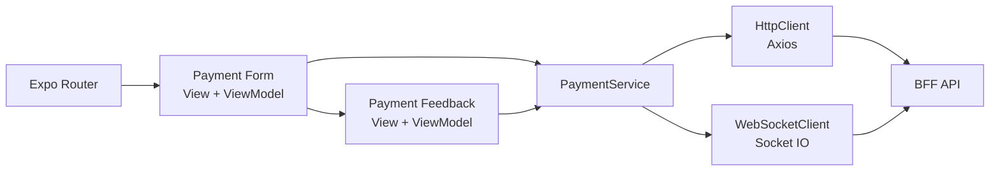

# Arquitetura do Mobile

## Visão geral

O app mobile (Expo + React Native) foi estruturado por feature, com separação entre View, ViewModel, domínio e infraestrutura de comunicação (HTTP e WebSocket). O objetivo é manter a UI simples e previsível, com lógica de tela concentrada em hooks de ViewModel.

## Estrutura em camadas

- `app/`
  - Rotas com Expo Router (`payment-form`, `payment-feedback`)
- `features/payment/`
  - Entidade de domínio (`Payment`), serviço de acesso a dados (`PaymentService`) e views
- `infrastructure/`
  - Clientes de integração (`AxiosHttpClient`, `SocketIoWebSocketClient`) e factories
- `components/`
  - Componentes reutilizáveis de UI (botão, campos, tipografia, containers)
- `hooks/`
  - Utilitários de composição, incluindo `withViewModel`

## Fluxo de navegação e dados

1. `app/index.tsx` redireciona para `/payment-form`
2. `payment-form.view-model` valida formulário e chama `PaymentService.processPayment()`
3. Após criação, navega para `/payment-feedback` com payload serializado
4. `payment-feedback.view-model` desserializa `Payment`, assina atualizações via WebSocket e atualiza estado da tela em tempo real

## Visão de desenvolvimento

### 1) Padrão View + ViewModel

Cada tela usa composição por `withViewModel(View, useViewModel)`, separando renderização da lógica de estado/efeitos.

### 2) Domínio explícito no cliente

A entidade `Payment` encapsula serialização/desserialização, validações mínimas de payload e helpers de estado (`isFinalStatus`, `isInProgress`).

### 3) Infraestrutura desacoplada por contratos

`PaymentService` depende de factories (`createHttpClient`, `createWebSocketClient`) e contratos abstratos, reduzindo acoplamento com bibliotecas específicas.

### 4) Comunicação híbrida: HTTP + WebSocket

- HTTP para iniciar pagamento
- WebSocket para acompanhar evolução do status sem polling

### 5) Organização de UI orientada a design system

Tema centralizado com Restyle (`ThemeProvider`) e componentes base (`ThemedText`, `ThemedView`, `TextField`, `Button`) para manter consistência visual.

## Diagrama de módulos (Mobile)

