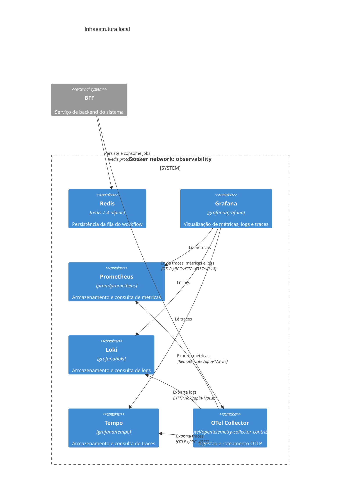

# Infraestrutura

Este documento descreve a infraestrutura local necessária para execução do projeto.

## Stack local

O ambiente local é provisionado com:

- **OpenTelemetry Collector** (ponto central de ingestão)
- **Tempo** (traces)
- **Prometheus** (métricas)
- **Loki** (logs)
- **Grafana** (visualização e correlação)
- **Redis** (fila persistente do workflow de pagamento)

## Ambiente e arquitetura

Todos os serviços sobem via `infra/docker-compose.yml` em uma rede bridge `observability`.

## Diagrama C4



Serviços e portas:

- Grafana: `localhost:3001`
- Prometheus: `localhost:9090`
- Loki: `localhost:3100`
- Tempo: `localhost:3200`
- Redis: `localhost:6379`
- OTel Collector:
   - OTLP gRPC: `localhost:4317`
   - OTLP HTTP: `localhost:4318`
   - Métricas internas: `localhost:8888`
   - Health check: `localhost:13133`

## Como subir e validar

```bash
cd infra/
docker compose up -d
docker compose ps
```

Para derrubar:

```bash
docker compose down
```

Para derrubar removendo volumes:

```bash
docker compose down -v
```

