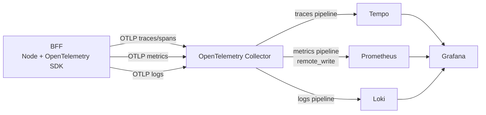

# Observabilidade

Este documento descreve a arquitetura de observabilidade local, integração no BFF e dashboard no Grafana.

## Fluxo de dados (trace, span, metric, log)

```text
BFF (Node + OTel SDK)
   ├─ traces/spans  ──OTLP──> OTel Collector ──> Tempo ──> Grafana
   ├─ metrics       ──OTLP──> OTel Collector ──> Prometheus (remote_write) ──> Grafana
   └─ logs          ──OTLP──> OTel Collector ──> Loki ──> Grafana
```



Detalhes importantes:

- O Collector recebe OTLP por HTTP (`4318`) e gRPC (`4317`).
- O pipeline de **traces** exporta para `tempo:4317`.
- O pipeline de **metrics** exporta para `prometheus:9090/api/v1/write` (remote write).
- O pipeline de **logs** exporta para `loki:3100/loki/api/v1/push`.
- O Prometheus está configurado para scrape das próprias métricas (`localhost:9090`) e das métricas internas do Collector (`otel-collector:8888`).

## Implementação no BFF

No BFF, a integração segue um padrão de **abstração + implementação OpenTelemetry**, acoplado ao Nest via **módulo global**.

### 1) Bootstrap de telemetria

- `apps/bff/src/infrastructure/observability/telemetry-bootstrap.ts`
   - Inicializa `NodeSDK` com auto-instrumentação.
   - Configura exporters OTLP de trace, metric e logs.
   - Define `resource` (`service.name`, `service.namespace`, `deployment.environment`).
- `apps/bff/src/main.ts`
   - Executa `startTelemetry()` antes de subir o Nest.
   - Executa `shutdownTelemetry()` no encerramento (`SIGINT`/`SIGTERM`).

### 2) Abstrações de domínio para observabilidade

Contratos:

- `AppLogger` (info/warn/error)
- `TraceInstrumenter` (`usingSpan`)
- `MetricRecorder` (`incrementCounter`/`recordHistogram`)

Implementações OTel:

- `OtelAppLogger`
- `OtelTraceInstrumenter`
- `OtelMetricRecorder`

### 3) Integração global no Nest

`ObservabilityModule.forRoot()` registra e exporta os três contratos como providers globais:

- `AppLogger -> OtelAppLogger`
- `TraceInstrumenter -> OtelTraceInstrumenter`
- `MetricRecorder -> OtelMetricRecorder`

Esse módulo é importado em `AppModule`, permitindo injeção em qualquer feature/provider sem wiring repetitivo.

## Exemplos de implementação no código

### Exemplo de tracing com `usingSpan`

No fluxo de pagamento (`PaymentService`):

```ts
return await this.traceInstrumenter.usingSpan("payment_execution", {}, async () => {
   // execução do fluxo
});
```

### Exemplo de métricas (counter + histogram)

No mesmo serviço:

```ts
this.metricRecorder.recordHistogram("payment_creation_duration_ms", durationMs, {
   action: "payment_creation",
   outcome,
});

this.metricRecorder.recordHistogram("payment_execution_duration_ms", durationMs, {
   action: "payment_execution",
   outcome,
});

this.metricRecorder.incrementCounter("payment_total", 1, { outcome });
```

E por step:

```ts
this.metricRecorder.recordHistogram("payment_step_duration_ms", durationMs, { step, outcome });
this.metricRecorder.incrementCounter("payment_step_total", 1, { step, outcome });
```

### Exemplo de logs correlacionados com trace/span

Nos adapters mock (ex.: `MockPaymentProcessor`):

```ts
this.appLogger.error("Payment processing failed", { context: "MockPaymentProcessor" });
this.appLogger.info("Payment processed successfully", { context: "MockPaymentProcessor" });
```

A implementação `OtelAppLogger` adiciona `trace_id` e `span_id` do contexto ativo quando houver span válido, permitindo navegação log → trace no Grafana.
Além disso, os logs carregam `event_name` padronizado para facilitar filtros no Loki/Grafana (ex.: `event_name="payment_processing_failed"`).

## Variáveis de ambiente úteis no BFF

Defaults já aplicados no bootstrap:

- `OTEL_SERVICE_NAME=bff`
- `OTEL_SERVICE_NAMESPACE=wallet-case`
- `NODE_ENV=dev`
- `OTEL_EXPORTER_OTLP_TRACES_ENDPOINT=http://localhost:4318/v1/traces`
- `OTEL_EXPORTER_OTLP_METRICS_ENDPOINT=http://localhost:4318/v1/metrics`
- `OTEL_EXPORTER_OTLP_LOGS_ENDPOINT=http://localhost:4318/v1/logs`
- `OTEL_METRIC_EXPORT_INTERVAL_MS=1000`

Para a fila de workflow no BFF:

- `REDIS_HOST=localhost`
- `REDIS_PORT=6379`
- `REDIS_DB=0`
- `REDIS_PASSWORD=` (opcional)

Para persistência de pagamentos no BFF (SQLite):

- `SQLITE_DB_PATH=data/wallet-case.sqlite`

## Acesso ao Grafana

- URL: <http://localhost:3001>
- Usuário: `admin`
- Senha: `admin`

Datasources são provisionados automaticamente em:

- `infra/grafana/provisioning/datasources/datasources.yml`

## Dashboard provisionada

Dashboard definida em:

- `infra/grafana/provisioning/dashboards/payment-observability.json`

Provisionamento da pasta no Grafana:

- provider `Wallet Case Dashboards`
- folder `Wallet Case`
- uid da dashboard: `bff-payments-overview`
- título: `BFF Payments Overview`
- refresh: `10s`
- janela padrão: últimos `15m`

Painéis já configurados:

- `Tentativas de Pagamento (Acumulado)` (stat)
- `Pagamentos Aprovados` (stat)
- `Tempo Médio do Pagamento` (stat)
- `Percentual de Sucesso (Pagamento)` (stat)
- `Tempo Médio por Step` (timeseries)
- `Eficiência por Step (Sem Retry Configurado)` (barchart)
- `Antifraud: Sucesso Sem vs Com Retry` (barchart)
- `Acquirer: Sucesso Sem vs Com Retry` (barchart)
- `Payment: Sucesso Sem vs Com Retry` (barchart)
- `Notification: Sucesso Sem vs Com Retry` (barchart)
- `Falhas na 1ª Tentativa por Step (Retry)` (barchart)
- `Traces Recentes (BFF)` (table via Loki + trace id)
- `Logs Recentes (BFF)` (table via Loki)
- `Distribuição de Erros por Step` (pie chart)
